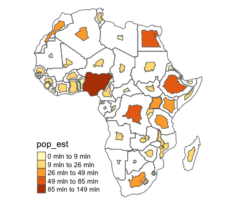
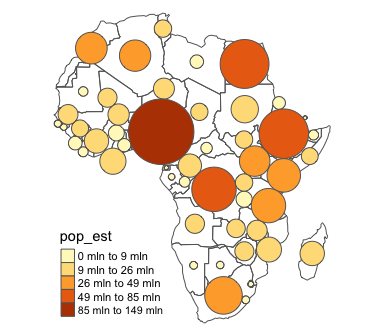

cartogram: Create Cartograms with R
================

[](https://cran.r-project.org/package=cartogram)
[](https://travis-ci.org/sjewo/cartogram)
[](https://cran.r-project.org/package=cartogram)

Construct a continuous area cartogram by a rubber sheet distortion
algorithm (Dougenik et al. 1985), non-contiguous Area Cartograms (Olson
1976), and non-overlapping Circles Cartogram (Dorling el al. 1996) in R.

## Installation

You can install the **cartogram** package from CRAN as follows:

``` r
install.packages("cartogram")
```

To upgrade to the latest development version of `cartogram`, install the
package `devtools` and run the following command:

``` r
devtools::install_github("sjewo/cartogram")
```

## NEWS

  - \[0.2.0\] Migrated all functions to sf, fixed problems with
    multipolygons. cartogram functions won’t accept features with
    longitude/latitude coordinates anymore.
  - \[0.1.1\] Speedup sf code
  - \[0.1.0\] Non-Overlapping Circles Cartogram (Dorling)
  - \[0.0.3\] sf support added
  - \[0.0.2\] Non-contiguous Area Cartogram
  - \[0.0.2\] Prepare data with missing or extreme values before
    cartogram calculation for faster convergence
  - \[0.0.1\] Initial Release

## Examples

### Continuous Area Cartogram

``` r
library(cartogram)
library(tmap)
library(maptools)
#> Loading required package: sp
#> Checking rgeos availability: TRUE

data(wrld_simpl)

# keep only the african continent
afr <- wrld_simpl[wrld_simpl$REGION == 2, ]

# project the map
afr <- spTransform(afr, CRS("+init=epsg:3395"))

# construct cartogram
afr_cont <- cartogram_cont(afr, "POP2005", itermax = 5)
#> Warning in CPL_crs_from_proj4string(x): GDAL Message 1: +init=epsg:XXXX syntax
#> is deprecated. It might return a CRS with a non-EPSG compliant axis order.
#> Mean size error for iteration 1: 5.79457153280442
#> Mean size error for iteration 2: 4.94825547349441
#> Mean size error for iteration 3: 4.32626995057149
#> Mean size error for iteration 4: 3.84940324694301
#> Mean size error for iteration 5: 3.45917774259599

# plot it
tm_shape(afr_cont) + tm_polygons("POP2005", style = "jenks") +
  tm_layout(frame = FALSE, legend.position = c("left", "bottom"))
```

<!-- -->

### Non-contiguous Area Cartogram

Many thanks to @rCarto and @neocarto for contributing the code\!

``` r
# construct cartogram
afr_ncont <- cartogram_ncont(afr, "POP2005")

# plot it
tm_shape(afr) + tm_borders() +
  tm_shape(afr_ncont) + tm_polygons("POP2005", style = "jenks") +
  tm_layout(frame = FALSE, legend.position = c("left", "bottom"))
```

<!-- -->

### Non-Overlapping Circles Cartogram

Many thanks to @rCarto for contributing the code\!

``` r
# construct cartogram
afr_dorling <- cartogram_dorling(afr, "POP2005")

# plot it
tm_shape(afr) + tm_borders() +
  tm_shape(afr_dorling) + tm_polygons("POP2005", style = "jenks") +
  tm_layout(frame = FALSE, legend.position = c("left", "bottom"))
```

<!-- -->

## sf support

Thanks to @Nowosad for speeding things up\!

``` r
library(sf)
#> Linking to GEOS 3.8.0, GDAL 3.0.2, PROJ 6.2.1

# Create an sf object
afr_sf <- st_as_sf(afr)

# Continuous Area Cartogram
afr_sf_cont <- cartogram_cont(afr_sf, "POP2005", 3)
#> Mean size error for iteration 1: 5.79457153280442
#> Mean size error for iteration 2: 4.94825547349441
#> Mean size error for iteration 3: 4.32626995057149

# Non-contiguous Area Cartogram
afr_sf_ncont <- cartogram_ncont(afr_sf, "POP2005")

# Non-overlapping Circles Cartogram
afr_sf_dorling <- cartogram_dorling(afr_sf, "POP2005")

# Plots
m1 <- tm_shape(afr_sf_cont) + tm_polygons("POP2005", style = "jenks", legend.show = FALSE) +
  tm_layout(frame = FALSE)

m2 <- tm_shape(afr_sf) + tm_borders() + 
  tm_shape(afr_sf_ncont) + tm_polygons("POP2005", style = "jenks", legend.show = FALSE) +
  tm_layout(frame = FALSE)

m3 <- tm_shape(afr_sf) + tm_borders() + 
  tm_shape(afr_sf_dorling) + tm_polygons("POP2005", style = "jenks", legend.show = FALSE) +
  tm_layout(frame = FALSE, legend.outside = TRUE)

ml <- tm_shape(afr_sf_dorling) + tm_polygons("POP2005", style = "jenks") +
  tm_layout(frame = FALSE, legend.only = TRUE, legend.position = c("center", "center"))

tmap_arrange(m1, m2, m3, ml, nrow = 1)
```

<!-- -->

## References

  - Dorling, D. (1996). Area Cartograms: Their Use and Creation. In
    Concepts and Techniques in Modern Geography (CATMOG), 59.
  - Dougenik, J. A., Chrisman, N. R., & Niemeyer, D. R. (1985). An
    Algorithm To Construct Continuous Area Cartograms. In The
    Professional Geographer, 37(1), 75-81.
  - Olson, J. M. (1976), Noncontiguous Area Cartograms. The Professional
    Geographer, 28: 371–380.
    [doi:10.1111/j.0033-0124.1976.00371.x](https://doi.org/10.1111/j.0033-0124.1976.00371.x)
